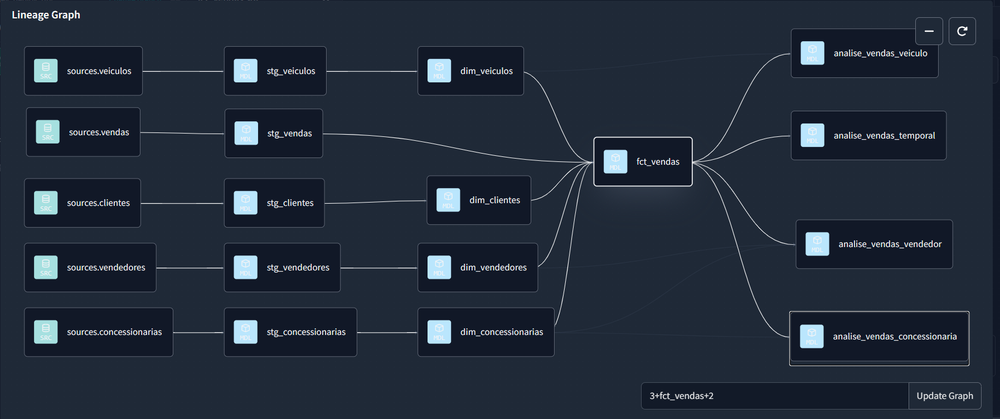
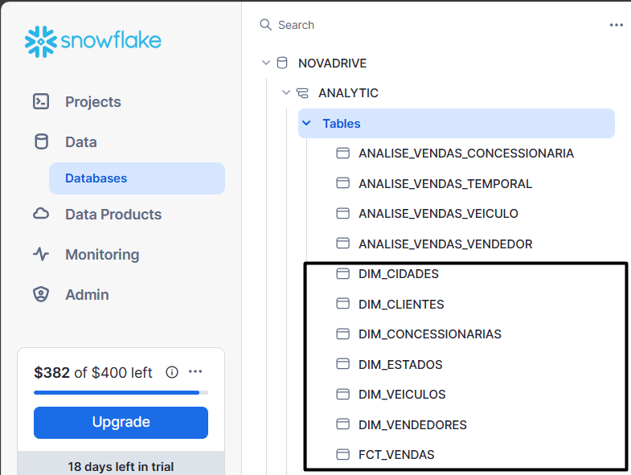

# Data Warehouse Project with Snowflake, DBT, Airflow, PostgreSQL & Looker Studio

In this project, I designed a **Data Warehouse** in **Snowflake** for business analytics of the fictitious dealership **NovaDrive Motors**. Built a DAG in **Apache Airflow** using **Python** to extract raw data incrementally from the transactional **PostgreSQL** database and load it into the Staging layer of the DWH. Leveraged **DBT** to transform and prepare data for the analytical layer, which powers a BI dashboard in **Looker Studio** for sales analysis.


## Extract:

Basically, in the first phase of the project, I extracted raw data from the transactional **PostgreSQL** database, specifically from the **sales**, **sellers**, **vehicles**, **states**, **cities**, **customers**, and dealerships tables of **NovaDrive Motors**.

Below is the **NovaDrive Motors** transactional database and its respective tables in **PostgreSQL**:

https://github.com/jv-mendes07/elt_data_warehouse_snowflake/assets/93790271/1dbe6d29-b19a-41ea-86ce-92fee3212284

To extract raw data from the transactional system **PostgreSQL** database (**OLTP**) of the dealership, I structured a **DAG** in **Airflow** to incrementally extract and load raw data from **PostgreSQL** into the intermediate layer (**Staging**) of the **Data Warehouse** in **Snowflake**.

Below is the **DAG** built in **Airflow** to perform the incremental load of raw data from **PostgreSQL** into the **DWH** in **Snowflake**.

https://github.com/jv-mendes07/elt_data_warehouse_snowflake/assets/93790271/01c3ec90-c281-47df-8e7d-e9ea534515b9

Below, it is visible that the raw data has been made available in the intermediate layer of the **Data Warehouse** in **Snowflake**:

https://github.com/jv-mendes07/elt_data_warehouse_snowflake/assets/93790271/92338726-e1b8-41db-a302-bf4d4b35225a

## Transform:

After loading the raw sales data of **NovaDrive Motors** into the **Snowflake DWH**, I used **DBT** to clean and transform the data, moving it from the Staging layer to the analytical layer. In this layer, the data is aggregated and prepared for business analysis, forming the foundation for the **BI dashboard**.

Below is the Pipeline built in DBT to handle all transformations and processing of **NovaDrive Motors** sales data:



Using **DBT**, I performed the dimensional **Star Schema** modeling for **NovaDrive Motors** dataset, transforming it into a fact table and dimension tables. This ensured the data was structured appropriately to support an advanced Data Warehouse capable of enabling business analytics and data-driven decision-making.

Below is an image of the fact table and dimension tables transformed with DBT and made available in the analytical layer of the Data Warehouse in Snowflake:



Before building the **BI (Business Intelligence)** dashboard for **NovaDrive Motors**' sales, I performed additional transformations with **DBT** to create aggregations and groupings. These steps ensured the data was properly prepared and ready for business analysis by the dashboard's end users.

**(1)** **Sales analysis by dealership**:

First, using **DBT**, I created a **SQL** query to retrieve the quantity sold, total revenue, and average revenue per dealership for **NovaDrive Motors**:

```
{{ config(materialized = 'table')}}
SELECT  
    con.concessionaria_id AS id,
    con.concessionaria,
    cid.nome_cidade AS cidade,
    est.nome_estado AS estado,
    COUNT(v.venda_id) AS quantidade_vendas,
    SUM(v.valor_venda) AS faturamento,
    AVG(v.valor_venda) AS faturamento_medio
FROM
    {{ ref('fct_vendas') }} v
JOIN
    {{ ref('dim_concessionarias')}} con
ON
    v.concessionaria_id = con.concessionaria_id
JOIN
    {{ ref('dim_cidades')}} cid 
ON
    cid.cidade_id = con.cidade_id
JOIN
    {{ ref('dim_estados')}} est
ON 
    est.estado_id = cid.estado_id
GROUP BY
    con.concessionaria_id,
    con.concessionaria,
    cid.nome_cidade,
    est.nome_estado
ORDER BY 
    faturamento DESC
```
**(2)** **Temporal sales analysis**:

Next, I created a **SQL** query to retrieve the quantity sold, total revenue, and average revenue per month for **NovaDrive Motors**:

```
{{ config(materialized = 'table')}}
SELECT  
    DATE_TRUNC('month', v.data_venda) AS mes_venda,
    COUNT(v.venda_id) AS quantidade_vendas,
    SUM(v.valor_venda) AS faturamento,
    AVG(v.valor_venda) AS faturamento_medio
FROM
    {{ ref('fct_vendas') }} v
GROUP BY
    DATE_TRUNC('month', v.data_venda)
ORDER BY 
    mes_venda ASC
```

**(3)** **Sales analysis by vehicle**:

Additionally, I created another **SQL** query to retrieve the quantity sold, total revenue, and average revenue per vehicle for **NovaDrive Motors**:

```
{{ config(materialized = 'table')}}
SELECT  
    vei.veiculo_id AS id,
    vei.nome_veiculo AS veiculo,
    vei.tipo AS tipo,
    vei.valor_sugerido AS valor_sugerido,
    COUNT(v.venda_id) AS quantidade_vendas,
    SUM(v.valor_venda) AS faturamento,
    AVG(v.valor_venda) AS faturamento_medio
FROM
    {{ ref('fct_vendas') }} v
JOIN
    {{ ref('dim_veiculos')}} vei
ON
    v.veiculo_id = vei.veiculo_id
GROUP BY
    vei.veiculo_id,
    vei.nome_veiculo,
    vei.tipo,
    vei.valor_sugerido
ORDER BY 
    faturamento DESC
```
**(4)** **Sales analysis by seller**:

Finally, I created another **SQL** query to retrieve the quantity sold, total revenue, and average revenue per seller for each dealership of **NovaDrive Motors**:

```
{{ config(materialized = 'table')}}
SELECT  
    ven.vendedor_id AS id,
    ven.nome_vendedor AS vendedor,
    c.concessionaria AS concessionaria,
    COUNT(v.venda_id) AS quantidade_vendas,
    SUM(v.valor_venda) AS faturamento,
    AVG(v.valor_venda) AS faturamento_medio
FROM
    {{ ref('fct_vendas') }} v
JOIN
    {{ ref('dim_vendedores')}} ven
ON
    v.vendedor_id = ven.vendedor_id
JOIN
    {{ ref('dim_concessionarias')}} c
ON
    c.concessionaria_id = ven.concessionaria_id
GROUP BY
    ven.vendedor_id,
    ven.nome_vendedor,
    c.concessionaria
ORDER BY 
    faturamento DESC
```

## BI (Business Intelligence) Dashboard for NovaDrive Motors Sales:

Finally, after **(1)** loading **NovaDrive Motors** raw data from **PostgreSQL** into the intermediate layer of the **DWH** in **Snowflake**, **(2)** performing all transformations and processing with **DBT** to move the raw data from the intermediate layer to the analytical layer, preparing it for advanced business analysis, I used **(3)** **Looker Studio** as a **BI** tool to build a **BI (Business Intelligence) dashboard**. This dashboard provides metrics, **KPIs**, and charts that deliver actionable insights to support data-driven decision-making for **NovaDrive Motors**' managers and executives.

https://github.com/jv-mendes07/elt_data_warehouse_snowflake/assets/93790271/42c1003a-00d5-440e-8902-4e0b0ad2e6c7

The **BI dashboard** for **NovaDrive Motors** sales allows filtering sales information by state and dealership. Additionally, it provides a **map chart** and **bar chart** to visualize which Brazilian states generate the highest revenue and sales for **NovaDrive Motors**.

## Final Considerations:

Finally, one potential improvement for this project would be **(1)** using a proper **ETL tool** to perform the extraction and incremental loading of raw data from **PostgreSQL** into the intermediate layer of the **Data Warehouse** in **Snowflake**, instead of using **Airflow**. This is because **Airflow** is primarily an orchestration tool rather than a data ingestion tool. In this case, it would be more appropriate to use **Data Factory** for incremental loading and leverage **Airflow** solely to orchestrate the **incremental pipelines** in **Data Factory**, handling the extraction of raw data from the source (**PostgreSQL**) and loading it into the destination (**Snowflake**).


